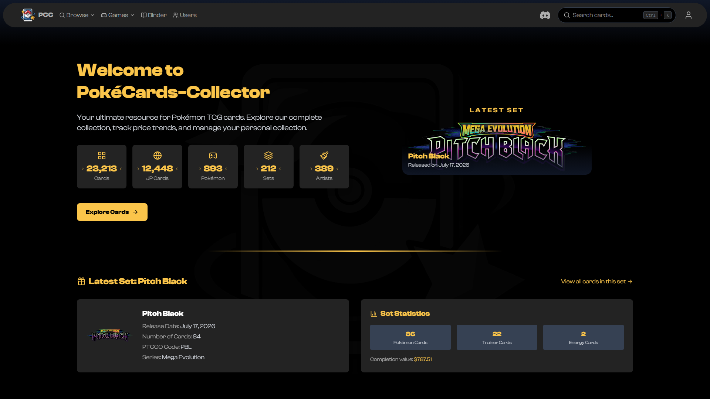

<div align="center">
  

  # PokéCards-Collector

  [](https://www.gnu.org/licenses/gpl-3.0)
  [](https://svelte.dev/docs/kit)
  [](https://svelte.dev/docs/svelte/what-are-runes)
  [](https://supabase.com/)
  [](https://www.typescriptlang.org/)
  [](https://tailwindcss.com/)
  [](https://workers.cloudflare.com/)
  [](https://bun.sh/)

  <p>A web application for browsing the Pokémon TCG catalogue and managing your collection</p>
</div>

## 📋 Overview

PokéCards-Collector browses the full Pokémon Trading Card Game catalogue - English and Japanese - and tracks what
you own and what you want. Cards, prices and sets come from [TCGdex](https://tcgdex.dev/), Pokédex entries from
[PokéAPI](https://pokeapi.co/), and everything is served from Supabase Postgres by a SvelteKit app running on
Cloudflare Workers.

### 📸 Website

Live at [pokecards-collector.ayfri.com](https://pokecards-collector.ayfri.com).



## ✨ Features

<table>
  <tr>
    <td>🔍</td>
    <td><b>Card Browser</b></td>
    <td>Every card at <code>/cards-list</code>, with filters on set, type, rarity, artist, dex number and price.</td>
  </tr>
  <tr>
    <td>🇯🇵</td>
    <td><b>Japanese Catalogue</b></td>
    <td><code>/japan</code> is a parallel data set with its own cards, sets and prices.</td>
  </tr>
  <tr>
    <td>📚</td>
    <td><b>Collection & Wishlist</b></td>
    <td>Track owned cards with quantities, keep a wishlist, and browse the public ones of other collectors.</td>
  </tr>
  <tr>
    <td>🗂️</td>
    <td><b>Binder</b></td>
    <td>Lay out digital binder pages and export them as an image, from card art or your own URLs.</td>
  </tr>
  <tr>
    <td>🧩</td>
    <td><b>Daily Games</b></td>
    <td><code>/card.dle</code> guesses the mystery card of the day, <code>/guess-the-price</code> its market value.</td>
  </tr>
  <tr>
    <td>🎨</td>
    <td><b>Artists, Sets, Pokédex</b></td>
    <td>Browse by illustrator, by set and series, or by Pokémon with its dex entry.</td>
  </tr>
  <tr>
    <td>🔐</td>
    <td><b>Accounts</b></td>
    <td>Supabase auth, public or private profiles, user search.</td>
  </tr>
  <tr>
    <td>🤖</td>
    <td><b>Data Pipeline</b></td>
    <td>A scraper CLI for full refreshes, plus a Cloudflare Workflow that refreshes Supabase every Monday.</td>
  </tr>
</table>

## 🛠️ Tech Stack

| Layer | What |
| --- | --- |
| Frontend | SvelteKit 2 + [Svelte 5 runes](https://svelte.dev/docs/svelte/what-are-runes), TypeScript, Tailwind CSS 4 (CSS-first, no config file), [Lucide icons](https://lucide.dev/) |
| Data | Supabase Postgres with row level security, [TCGdex](https://tcgdex.dev/) for cards/prices/sets, [PokéAPI](https://pokeapi.co/) for Pokédex entries |
| Hosting | Cloudflare Workers with static assets, via `@sveltejs/adapter-cloudflare` |
| Jobs | A second Worker holding a Cloudflare Workflow, scheduled weekly |
| Tooling | Bun (runtime, package manager and lockfile), Wrangler, Vite, `svelte-check` |

## 🚀 Getting Started

<details>
<summary><b>Prerequisites</b></summary>

- [Bun](https://bun.sh/docs/installation) 1.4 or later
- A [Supabase](https://supabase.com/) project

TCGdex needs no API key, so there is nothing else to sign up for.
</details>

<details open>
<summary><b>Installation</b></summary>

1. **Clone the repository:**
   ```bash
   git clone https://github.com/Ayfri/PokeCards-Collector.git
   cd PokeCards-Collector
   ```

2. **Install dependencies:**
   ```bash
   bun install
   ```

3. **Set up the database:**
   - Create a project on [Supabase](https://supabase.com/)
   - Run the files in `supabase/migrations/` in filename order from the SQL Editor. Run the last two together:
     `20260829110000_rls_policies.sql` is what keeps the catalogue readable once
     `20260829120000_enable_rls.sql` turns row level security on.
   - Grab the project URL and the keys from Project Settings > API Keys

4. **Configure environment variables:**
   Copy `.env.example` to `.env` and fill it in:
   ```dotenv
   PUBLIC_SUPABASE_URL=https://<project>.supabase.co
   PUBLIC_SUPABASE_PUBLISHABLE_KEY=sb_publishable_...
   SUPABASE_SECRET_KEY=sb_secret_...
   SCRAPER_TRIGGER_TOKEN=
   PUBLIC_NO_IMAGES=false
   ```
   `SUPABASE_SECRET_KEY` bypasses row level security and must never carry the `PUBLIC_` prefix: SvelteKit
   serialises every `PUBLIC_` variable into the SSR HTML. In production it is a Wrangler secret.

5. **Fill the database:**
   ```bash
   bun run scrapers all
   ```

6. **Run the development server:**
   ```bash
   bun run dev
   ```
   The app runs on `http://localhost:5173`.
</details>

## 📊 Data Scraping

`bun run scrapers` opens an interactive menu, `bun run scrapers <command>` runs one command directly, and
`bun run scrapers --help` lists everything.

<details>
<summary><b>Commands</b></summary>

| Command | Description | Needs |
| --- | --- | --- |
| `all` | `scrape`, then `pokemons`, then `supabase all`, in dependency order. | Supabase credentials |
| `scrape` | Fetch every card, price and set from TCGdex into `src/assets/`. `--lang en,ja` picks the languages. | Nothing |
| `pokemons` | Fetch Pokédex names and descriptions from PokéAPI. | Nothing |
| `audit` | Rebuild `set-aliases.json` and `card-code-overrides.json`, and report the codes that stop resolving. | Supabase credentials |
| `verify` | Check the scraped JSON for `card_code` collisions and owned cards that no longer resolve. `--offline` skips Supabase. | `scrape` |
| `supabase <target>` | Push one JSON file into its table: `all`, `cards`, `jp-cards`, `prices`, `jp-prices`, `sets`, `jp-sets`, `types`, `pokemons`. | `scrape` |

Every command takes `--dry-run` (run without writing), `--json` (raw report), `-q` (summary only) and `--help`.

A full pass takes about 15 s for ~36 000 cards, the CLI going through an HTTP/2 connection pool. `supabase` needs
the sets uploaded before the cards, and the cards before the prices; `all` already orders them. Run `verify`
between `scrape` and the upload to check the output.
</details>

<details>
<summary><b>Scheduled refresh</b></summary>

`src/workers/scraper.ts` is a second Worker holding the `ScrapeWorkflow` Cloudflare Workflow. It fires every
Monday at 04:00 UTC, one Workflow step per batch of 4 sets so a failing batch retries alone, and writes TCGdex
straight into Supabase with no staged JSON. It never deletes rows: a half-finished pass would drop the cards it
had not reached yet.

```bash
bun run deploy:scraper
bunx wrangler secret put SUPABASE_SECRET_KEY -c wrangler.scraper.toml
bunx wrangler secret put SCRAPER_TRIGGER_TOKEN -c wrangler.scraper.toml
```

`SCRAPER_TRIGGER_TOKEN` is the bearer token for the manual `POST /run` on the scraper Worker.
</details>

<details>
<summary><b>Card images</b></summary>

Card art is served straight from `assets.tcgdex.net`, which is CDN-fronted, CORS-open and speaks HTTP/3, so there
is no mirror and no proxy. A card's `image` field is an extensionless base such as
`https://assets.tcgdex.net/en/swsh/swsh3/136`, and `processCardImage` appends `/{quality}.{extension}` -
`high.webp` by default, about 89 KB against 344 KB for the same card as a PNG.

Set `PUBLIC_NO_IMAGES=true` to render placeholders instead and develop without bandwidth.
</details>

## 📜 Available Scripts

| Command | Description |
| --- | --- |
| `bun run dev` | Vite dev server on `localhost:5173` |
| `bun run build` | Production build through `adapter-cloudflare`, into `.svelte-kit/cloudflare` |
| `bun run preview` | Preview the built output with Vite |
| `bun run preview:worker` | Build, then serve the real Worker locally with `wrangler dev` |
| `bun run deploy` | Build, then `wrangler deploy` (site Worker, `wrangler.toml`) |
| `bun run deploy:scraper` | Deploy the weekly scraper Worker (`wrangler.scraper.toml`) |
| `bun run scrapers` | Scraper CLI - a command as argument, the interactive menu without |

There is no test suite and no lint script. `svelte-check` is installed but not wired to a script; run it with
`bunx svelte-check`.

## 📁 Project Structure

<details>
<summary><b>View Project Structure</b></summary>

```
.
├── src/
│   ├── assets/              # Scraper output staged for upload, not the app's runtime source
│   ├── lib/
│   │   ├── components/      # Svelte components, grouped by feature (card, binder, filters, ...)
│   │   ├── data/            # set-aliases.json, generated by `scrapers audit`
│   │   ├── helpers/         # Pure-ish utilities: supabase-data, card-utils, card-images, filters, ...
│   │   ├── services/        # Supabase CRUD for user-owned data, returns { data, error }
│   │   ├── stores/          # Cross-component state, incl. localStorage-backed stores
│   │   └── supabase.ts      # Browser Supabase client
│   ├── routes/              # Pages and API endpoints
│   ├── scrapers/            # TCGdex + PokéAPI scrapers and the Supabase uploaders
│   ├── workers/scraper.ts   # The weekly ScrapeWorkflow Worker
│   ├── app.css              # Tailwind entry, holds the @theme block
│   ├── hooks.server.ts      # Per-request Supabase client, user and profile on event.locals
│   └── constants.ts
├── supabase/migrations/     # SQL migrations: schema, indexes, grants, policies, RLS
├── static/                  # Favicon and static files
├── scraper-cli.ts           # Scraper CLI entry point
├── svelte.config.js         # Adapter and path aliases
├── vite.config.ts           # Vite + @tailwindcss/vite
├── wrangler.toml            # Site Worker
└── wrangler.scraper.toml    # Scraper Worker
```

There is no `tailwind.config.mjs`: Tailwind 4 is configured CSS-first from the `@theme` block in `src/app.css`.
</details>

## 🔑 Card Identity

Cards are keyed by a synthetic `cardCode` of the form `supertype_pokemonId_setCode_cardNumber`, for example
`pokemon_25_swsh3_136`. It is the join key everywhere: routes (`/card/[cardCode]`), price lookups, collection and
wishlist rows.

The `setCode` inside a code is the legacy pokemontcg.io / tcgcollector code rather than the TCGdex set id
(`sv3` against `sv03`), so codes minted before the TCGdex migration keep matching.
`src/lib/data/set-aliases.json` maps one onto the other, and `src/scrapers/tcgdex/card-code-overrides.json` pins
the ~4300 cards whose natural code would differ from the stored one. Both files are regenerated by
`bun run scrapers audit`.

## 👥 Contributing

Contributions are welcome.

<details>
<summary><b>How to Contribute</b></summary>

1. Fork the repository
2. Create your feature branch (`git checkout -b feature/amazing-feature`)
3. Commit your changes (`git commit -m 'feat: add some amazing feature'`)
4. Check the types with `bunx svelte-check` - it reports 0 errors and 0 warnings, keep it that way
5. Push to the branch (`git push origin feature/amazing-feature`)
6. Open a Pull Request

`CLAUDE.md` documents the stack constraints and conventions the codebase follows; it is worth reading before a
first change.
</details>

## 📄 License

This project is licensed under the GNU GPLv3 License - see the [LICENSE](LICENSE) file for details.

<div align="center">
  <br>
  <p>
    <a href="https://github.com/Ayfri/PokeCards-Collector/issues">Report Bug</a>
    ·
    <a href="https://github.com/Ayfri/PokeCards-Collector/issues">Request Feature</a>
    ·
    <a href="https://discord.com/invite/7c7nzHqxJx">Discord</a>
  </p>
  <p>
    Made with ❤️ by <a href="https://github.com/Ayfri">Ayfri</a>,
    <a href="https://github.com/antaww">Anta</a>,
    <a href="https://github.com/Bahsiik">Bahsiik</a>
  </p>
</div>
